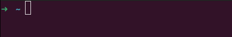
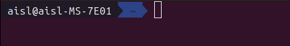

# oh my zsh 설치 가이드
[Linux에서 brew 사용하기](./brew.md)

## zsh란?
z shell은 주로 맥에서 사용하는 확장형 셀이다.

## zsh 설치
::: code-tabs#shell
@tab apt
```bash
sudo apt install zsh
```
@tab brew
```bash
brew install zsh
```
:::

## zsh 확인
zsh의 버전을 확인해보자.
::: code-tabs#shell
@tab Bash
```bash
zsh --version
```
:::
```bash
zsh 5.9 (x86_64-pc-linux-gnu)
```
zsh가 설치된 위치를 확인해보자
::: code-tabs#shell
@tab Bash
```bash
which zsh
```
:::
```bash
/home/linuxbrew/.linuxbrew/bin/zsh
```
필자는 brew를 통해 설치했기 때문에 여기에 있다. apt로 설치하면 `/bin/zsh`에 있을 것이다.

## PATH 추가
위를 보면 필자의 `zsh`는 `/home/linuxbrew/.linuxbrew/bin/zsh`에 설치된 것을 알 수 있다. 이를 사용하기 위해선 `/etc/shells`에 등록해줘야 한다.
::: code-tabs#shell
@tab Bash
```bash
sudo vim /etc/shells
```
:::
or
::: code-tabs#shell
@tab Bash
```bash
sudo sh -c 'echo "/home/linuxbrew/.linuxbrew/bin/zsh" >> /etc/shells'
```
:::
or
::: code-tabs#shell
@tab Bash
```bash
echo "/home/linuxbrew/.linuxbrew/bin/zsh" | sudo tee -a /etc/shells
```
:::

## oh my zsh 설치
::: code-tabs#shell
@tab Bash
```bash
sh -c "$(curl -fsSL https://raw.githubusercontent.com/ohmyzsh/ohmyzsh/master/tools/install.sh)"
```
:::
```bash {22,32}
Cloning Oh My Zsh...
remote: Enumerating objects: 1431, done.
remote: Counting objects: 100% (1431/1431), done.
remote: Compressing objects: 100% (1366/1366), done.
remote: Total 1431 (delta 45), reused 1012 (delta 37), pack-reused 0 (from 0)
오브젝트를 받는 중: 100% (1431/1431), 3.26 MiB | 8.61 MiB/s, 완료.
델타를 알아내는 중: 100% (45/45), 완료.
https://github.com/ohmyzsh/ohmyzsh URL에서
 * [새로운 브랜치]   master     -> origin/master
branch 'master' set up to track 'origin/master'.
이미 'master'에 있습니다
/home/user-name

Looking for an existing zsh config...
Found /home/user-name/.zshrc. Backing up to /home/user-name/.zshrc.pre-oh-my-zsh
Using the Oh My Zsh template file and adding it to /home/user-name/.zshrc.

Time to change your default shell to zsh:
Do you want to change your default shell to zsh? [Y/n] y
Changing your shell to /home/linuxbrew/.linuxbrew/bin/zsh...
[sudo] user-name 암호: 
Shell successfully changed to '/home/linuxbrew/.linuxbrew/bin/zsh'.

         __                                     __   
  ____  / /_     ____ ___  __  __   ____  _____/ /_  
 / __ \/ __ \   / __ `__ \/ / / /  /_  / / ___/ __ \ 
/ /_/ / / / /  / / / / / / /_/ /    / /_(__  ) / / / 
\____/_/ /_/  /_/ /_/ /_/\__, /    /___/____/_/ /_/  
                        /____/                       ....is now installed!


Before you scream Oh My Zsh! look over the `.zshrc` file to select plugins, themes, and options.

• Follow us on X: @ohmyzsh
• Join our Discord community: Discord server
• Get stickers, t-shirts, coffee mugs and more: Planet Argon Shop

➜  ~ 
```
시스템 reboot을 해야 다음 터미널부터 적용이 된다.
::: code-tabs#shell
@tab Bash
```bash
sudo reboot
```
:::
:::details oh my zsh reinstall
다음 명령을 사용하고서 다시 `sh` 명령을 입력하면 된다.
::: code-tabs#shell
@tab Bash
```bash
sudo rm -rf /home/aisl/.oh-my-zsh
```
:::

## 기본 쉘 변경
기본 쉘로 zsh를 수동으로 바꾸고자 한다면 다음 명령을 입력하면 된다.
::: code-tabs#shell
@tab Bash
```bash
chsh -s `which zsh`
```
:::
다시 bash로 돌아가고 싶다면 우리에게 친숙한 `/bin/bash`로 돌아가면 된다.
::: code-tabs#shell
@tab Bash
```bash
chsh -s /bin/bash
```
:::
다른 쉘의 목록을 보고자 한다면 다음 명령을 입력하면 된다.
::: code-tabs#shell
@tab Bash
```bash
cat /etc/shells
```
:::
```bash
# /etc/shells: valid login shells
/bin/sh
/usr/bin/sh
/bin/bash
/usr/bin/bash
/bin/rbash
/usr/bin/rbash
/usr/bin/dash
/home/linuxbrew/.linuxbrew/bin/zsh
```

## 테마 변경
다음 명령으로 `.zshrc`에 들어간다.
::: code-tabs#shell
@tab Bash
```bash
vi ~/.zshrc
```
:::
기본인 `robbyrussell` 대신에 인기 좋은 `agnoster`로 바꿔보겠다.

- robbyrussell
  - 
- agnoster
  - 
아마 폰트가 깨질텐데, 아래 명령어들을 입력해주면 해결 된다.
::: code-tabs#shell
@tab Bash
```bash
git clone https://github.com/powerline/fonts.git --depth=1
```
:::
::: code-tabs#shell
@tab Bash
```bash
cd fonts && ./install.sh
```
:::

## brew 설정
이전에 `brew`를 설치하는 블로그에 작성했듯이 `.bashrc`에 설정을 구성했었다. 이를 동일하게 `.zshrc`에 구성하면 된다.
::: code-tabs#shell
@tab Bash
```bash
echo >> /home/user-name/.zshrc
```
:::
::: code-tabs#shell
@tab Bash
```bash
echo 'eval "$(/home/linuxbrew/.linuxbrew/bin/brew shellenv)"' >> /home/user-name/.zshrc
```
:::
::: code-tabs#shell
@tab Bash
```bash
eval "$(/home/linuxbrew/.linuxbrew/bin/brew shellenv)"
```
:::

## 추가 플러그인 설치
`zsh-syntax-highlighting`와 `zsh-autosuggestions`를 시범적으로 설치를 해보겠다.
::: code-tabs#shell
@tab brew
```bash
brew install zsh-syntax-highlighting
```
:::
::: code-tabs#shell
@tab brew
```bash
brew install zsh-autosuggestions
```
:::
::: code-tabs#shell
@tab Bash
```bash
vi ~/.zshrc
```
:::
다음 내용을 `~/.zshrc` 최하단에 추가한다.
```bash
source /home/linuxbrew/.linuxbrew/opt/zsh-syntax-highlighting/share/zsh-syntax-highlighting/zsh-syntax-highlighting.zsh
source /home/linuxbrew/.linuxbrew/opt/zsh-autosuggestions/share/zsh-autosuggestions/zsh-autosuggestions.zsh
```
위 위치는 `ubuntu 24.04` 기준이라 맥os는 어떤지 잘 모르겠다. 기억하기론 `/opt/homebrew/share/package-name/package-name.zsh`였던 것 같다.
::: code-tabs#shell
@tab Bash
```bash
. ~/.zshrc
```
:::
or
::: code-tabs#shell
@tab Bash
```bash
source ~/.zshrc
```
:::
이러면 적용이 된다.
