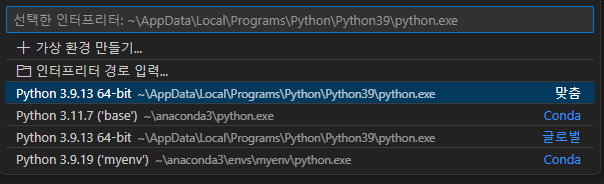
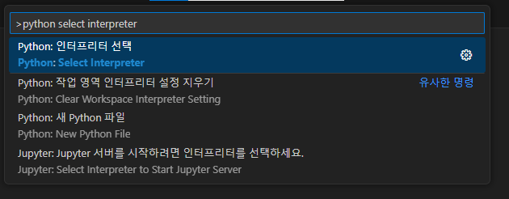
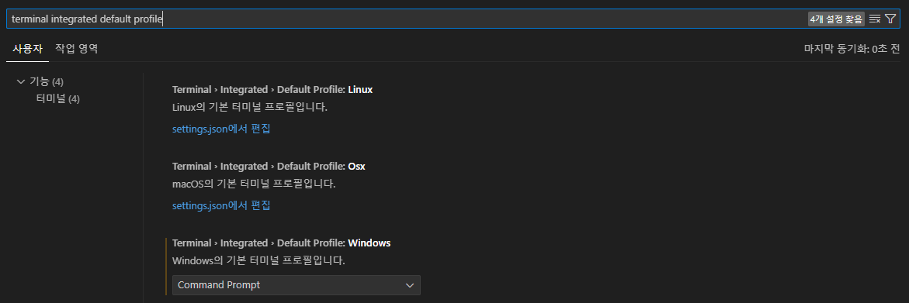

# 아나콘다 가상환경

## 1. 아나콘다를 사용하는 이유
아나콘다를 사용하는 이유는 많을 것이다. 그 중에서도 가상 환경을 구축하는 데에 있어 유용하게 사용할 수 있게 때문에 사용하는 사람도 많다.


anaconda는 설치하는 데에 어려움은 없으니 넘어가도록 하겠다.

## 2. [아나콘다 가상 환경](https://conda.io/projects/conda/en/latest/user-guide/tasks/manage-environments.html#activating-an-environment)
아나콘다에서 가상환경에 관련된 명령어를 소개하겠다. 물론 아나콘다에 관한 환경변수를 설정하지 않았기 때문에 anaconda prompt를 이용할 것이다.

우선은 생성, 확인, 활성화, 종료에 관한 명령만 알아볼 것이다. 더 궁금한 사람은 위 링크를 타고 가면 된다.

### 2.1. create env
```console
> conda create -n myenv python=3.9
```
- -n `myenv`: env name에 관련된 인자이다.
- python=`3.9` : 파이썬 버전 중 최신
- scipy=`0.17.3` : 특정 버전의 파이썬

인자들의 구분은 띄어쓰기이다.

### 2.2. list of env
```console
> conda env list
```
- 로컬 pc에 있는 env들이 목록으로 나옴

### 2.3. activate env
```console
> conda activate myenv
```

### 2.4. deactivate env
```console
> conda deactivate
```

### 2.5. remove env
```console
> conda env remove -n myenv
```

## 3. with VSCode
(python extention 설치가 선행되어야함)

`Ctrl + Shift + P`를 입력하여 command 창을 열어서 `python select interpreter`를 검색해준다.



해당 옵션을 선택하면 로컬 환경에 설치되어 있는 python 환경부터 위에서 만든 conda env까지 여러가지 옵션이 뜬다. 우리는 여기서 아까 만들어둔 env를 선택하면 된다.



vsc에서 자동으로 cmd에 env를 activate 시켜주는데 powershell은 안되는 현상이 있다.



위와 같이 설정을 바꾸거나, 아래와 같은 설정을 `settings.json`에 추가하면 vsc 터미널을 열었을 때 cmd로 열리게 된다.

```json
"terminal.integrated.defaultProfile.windows": "Command Prompt",
```

## 4. dependency
VSCode 기준으로 **Ctrl + `** 를 입력하면 터미널이 생기는데, 조금만 기다리면 바로 가상환경으로 세팅이 된다. 이제 이 환경에 의존성을 설치하면 된다.

### 4.1. install
```console
pip install package_name
```

### 4.2. list
```console
pip list
```

### 4.3. uninstall
```console
pip uninstall package_name
```

### 4.4. freeze
freeze는 매우 중요하다. 이유는 해당 파이썬 프로그램이 필요한 의존성들의 버전까지 상세히 적어주기 때문이다.
```console
pip freeze > requirements.txt
```

당연히 이를 이용해서 빠르게 의존성을 모두 설치할 수도 있다.
```console
pip install -r requirements.txt
```

requirements.txt에는 라이브러리 이름 옆에 `==version`으로 쓰인다. 이 때 해당 버전 이상만 설치하면 된다는 표기는 `>=version`이다.

---
이제 프로젝트마다 버전 관리하느라 고민할 필요가 없어졌다.